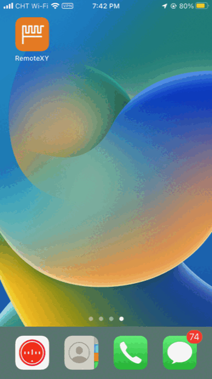
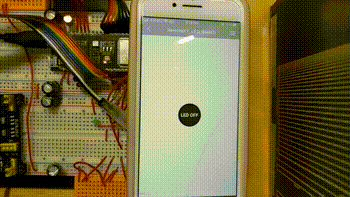
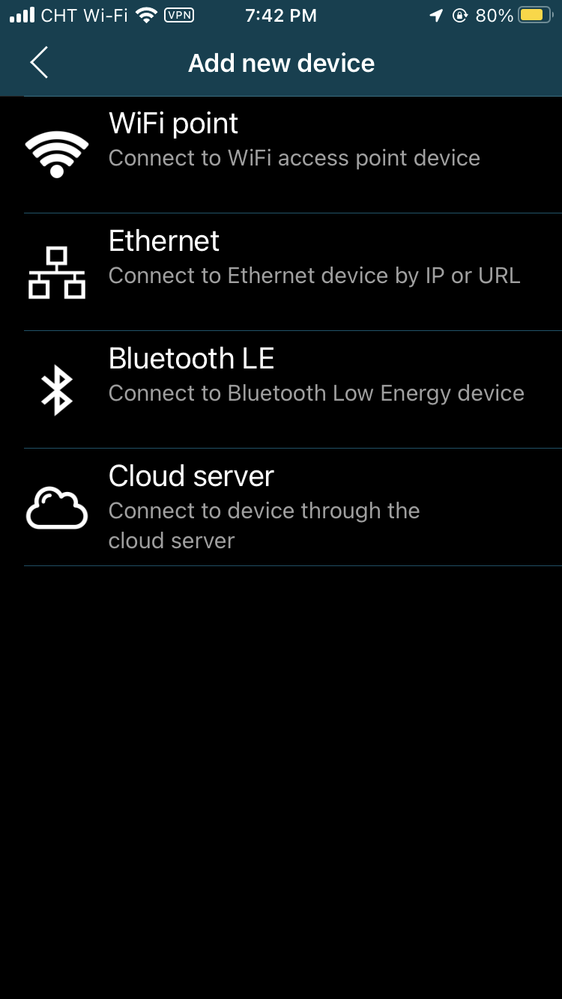
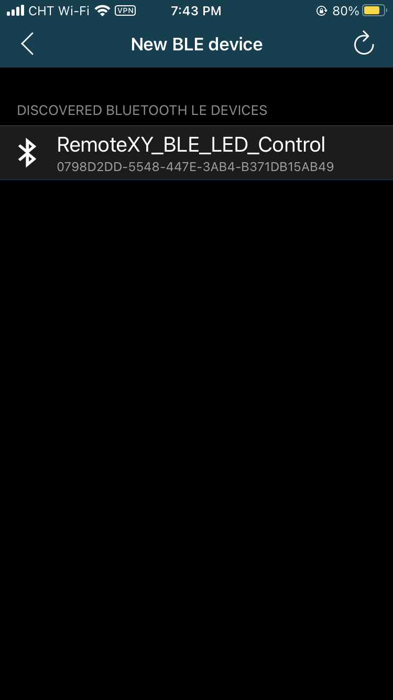
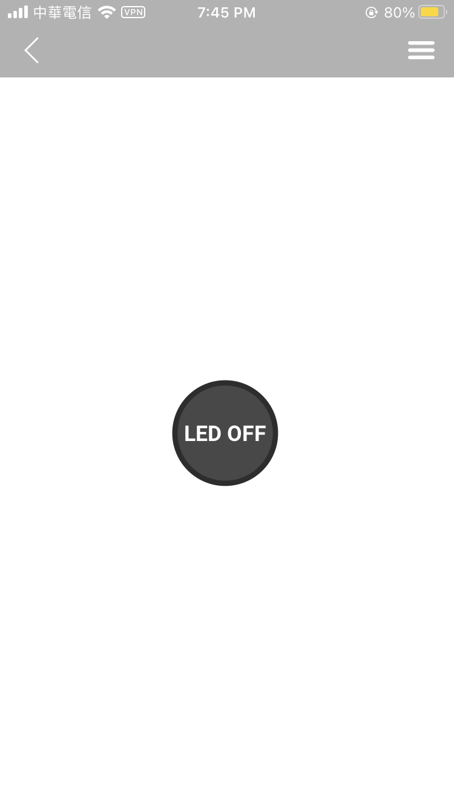
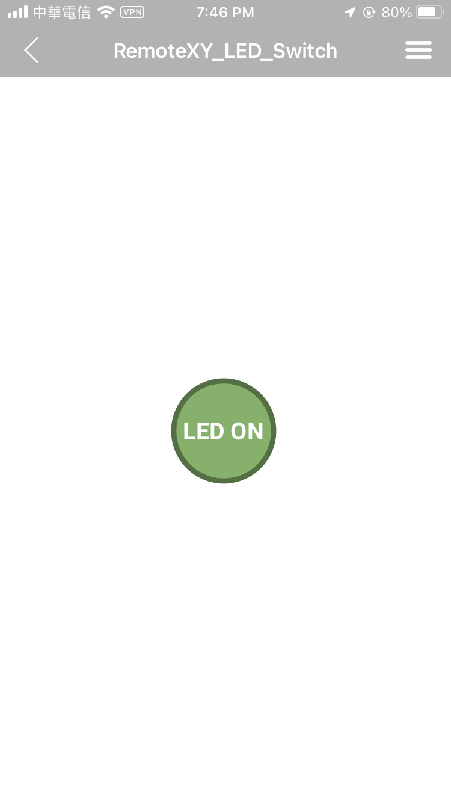
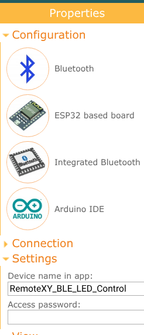
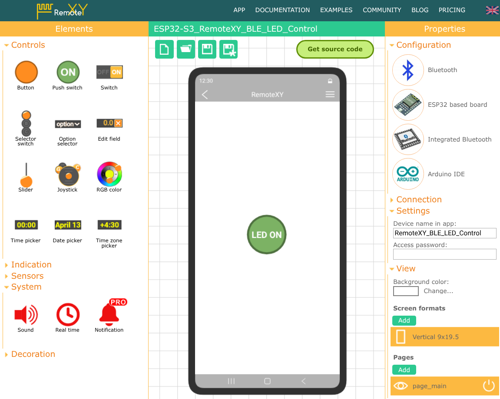
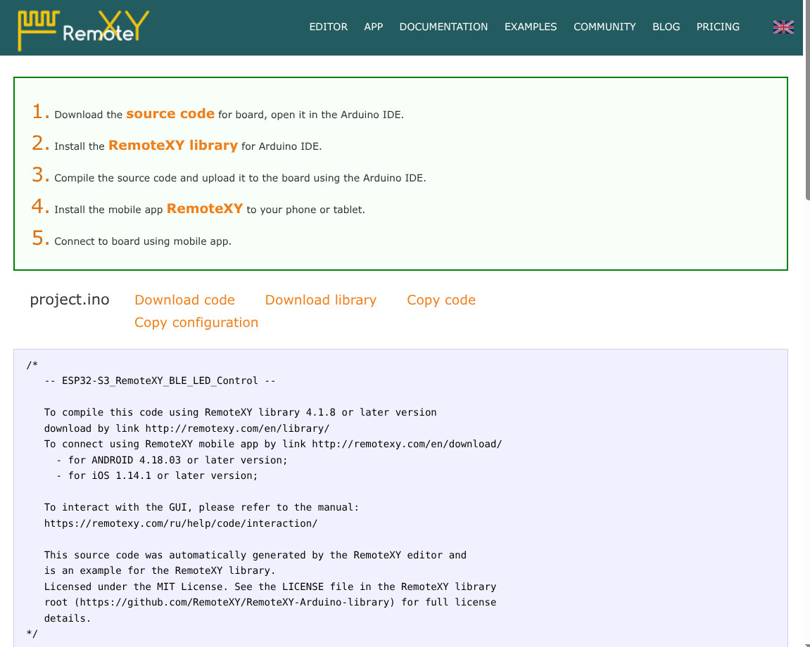

# Switching an LED from a phone over Bluetooth (ESP32-S3, RemoteXY)

One button in the RemoteXY app turns an LED on GPIO 2 and the board's own RGB LED on and off over Bluetooth Low Energy. The app screen is made in the RemoteXY editor, so no app code is needed.

It is the smallest RemoteXY example I could make; the same kind of phone control is used in the [ESP32-S3 Vehicle Warning System](https://github.com/waitingate/ESP32-S3_Vehicle_Warning_System).

| The app (iPhone) | The board |
| --- | --- |
|  |  |

## Hardware

- ESP32-S3-DevKitC-1U-N8R8 (8 MB flash, 8 MB octal PSRAM), or another ESP32-S3 board
- an LED and a 220 Ω or 330 Ω resistor
- a phone with Bluetooth (Android or iPhone)

## Wiring

| Part | GPIO |
| --- | --- |
| LED + (through the resistor) | 2 |
| LED - | GND |
| On-board RGB LED (WS2812) | 38, nothing to wire |

Some ESP32-S3 boards have the RGB LED on GPIO 48. If it stays dark, change `PIN_RGB_BUILTIN` in `src/main.cpp`.

## Building

1. Install VS Code (or VSCodium) with the PlatformIO extension, and the [RemoteXY app](https://remotexy.com/en/download/) on the phone.
2. Clone this repo and open the folder in PlatformIO.
3. Build and upload. PlatformIO installs the RemoteXY library (4.1.8 or newer) by itself.

`platformio.ini` is set up for the N8R8 board (octal PSRAM, 80 MHz flash, default 8 MB partitions). For a board with quad-SPI PSRAM (for example N8R2) or without PSRAM, change `board_build.arduino.memory_type = qio_opi` to `qio_qspi`, or remove that line.

## Using it

1. Switch on Bluetooth on the phone and open RemoteXY.
2. Tap `+`, then Bluetooth LE.
3. Pick `RemoteXY_BLE_LED_Control` from the list (no password).
4. Tap the button: LED ON lights the LED on GPIO 2 and turns the RGB LED green; LED OFF turns both off.

The serial monitor (115200 baud) shows `>> Bluetooth Started. Waiting for App connection...` after a reset.

iPhone: with Low Power Mode on, the connection can fail or the LED reacts late. Turn it off under Settings > Battery. On Android, Battery Saver made no difference.

## Changing the app screen

1. Open the [RemoteXY editor](https://remotexy.com/en/editor/). Under Configuration choose Bluetooth BLE, ESP32 and Arduino IDE.

   

2. Drag buttons, sliders or text onto the phone screen. Each element gets a variable name, for example `pushSwitch_01`; that is the name used in `main.cpp`.

   

3. Click Get source code and copy two parts into `src/main.cpp`, replacing the old ones: the `#pragma pack` block with `RemoteXY_CONF_PROGMEM`, and the `struct { ... } RemoteXY;` block.

   

Keep `REMOTEXY_MODE__ESP32CORE_BLE` and the Bluetooth name at the top of `main.cpp`. In `loop()` use `RemoteXYEngine.delay()` instead of `delay()`, so the Bluetooth connection keeps running.

`docs/remotexy_original_backup.cpp` is the code exactly as the editor generated it, before my changes.

## Files

- `src/main.cpp` - the program
- `platformio.ini` - board settings and the RemoteXY library
- `docs/remotexy_original_backup.cpp` - the unchanged code from the RemoteXY editor
- `img/` - screenshots and the demo animations (`hardware_demo_toggle.mp4` is the board video as MP4)

## License

`main.cpp` started from code generated by the RemoteXY editor, which comes under the MIT licence of the [RemoteXY library](https://github.com/RemoteXY/RemoteXY-Arduino-library).
